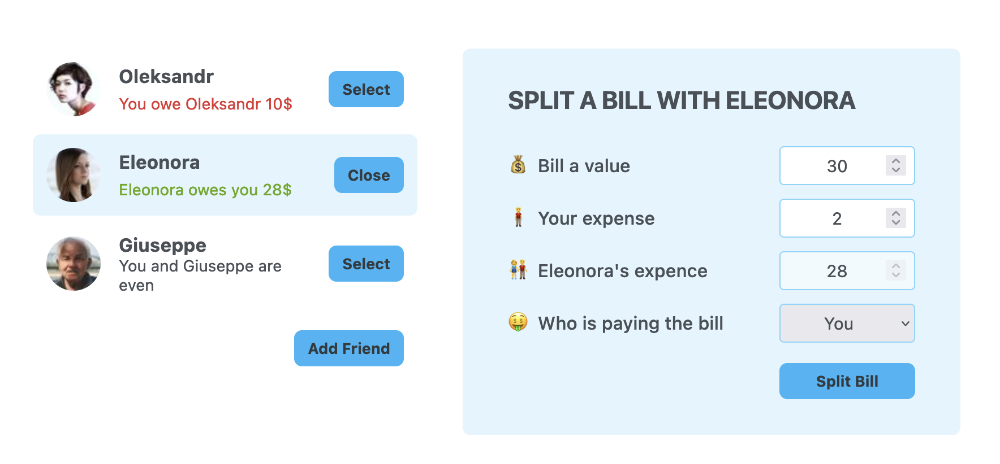

# Eat-n-Split

Welcome to Eat-n-Split, an application designed to help you split bills and expenses with ease!

## Introduction

Eat-n-Split is a small React project I developed while following a React course, which has provided me with a solid foundation in state management using `useState`. This application is perfect for dividing bills and expenses when you go out to eat with friends or colleagues. It streamlines the process of splitting the bill and helps you keep track of who owes whom.

## Getting Started

To run the application locally, follow these steps:

1. Ensure you have Node.js installed on your computer.
2. Download or clone the Eat-n-Split repository to your local machine.
3. Open your preferred terminal and navigate to the project folder.
4. Install all the necessary dependencies by running the command `npm install`.
5. Start the development server with the command `npm run dev`.

The application will then be accessible locally at `http://localhost:5174/`.

## Embracing Modern Technologies

The Eat-n-Split application leverages the following modern technologies:

- React: The leading JavaScript library for building robust and interactive user interfaces.

Join us at Eat-n-Split and make splitting bills a breeze!
